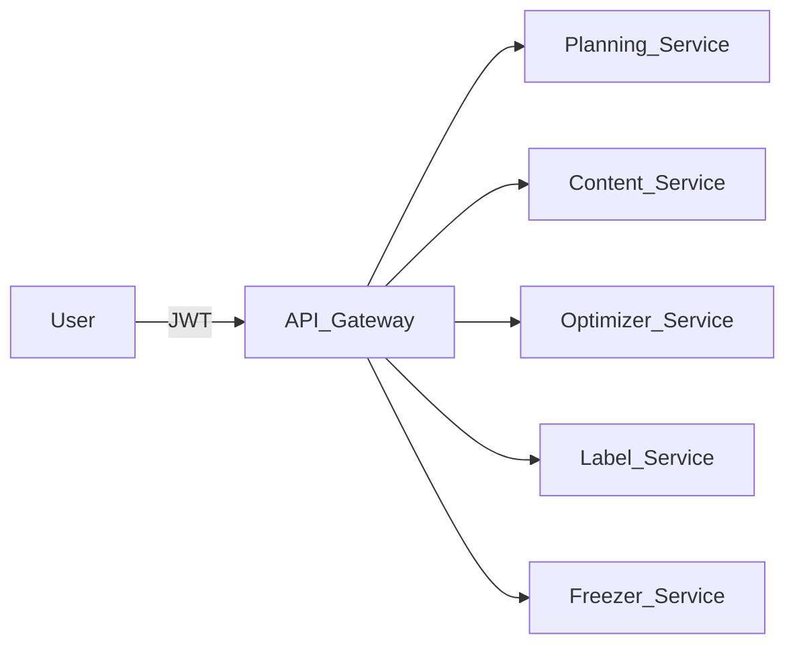

# MP360 Core Architecture

## Overview

MealPrep360 is composed of modular services managed via an API Gateway. Each service is responsible for a distinct domain and communicates over REST APIs, secured with JWT authentication.

## Modules

- **API Gateway**  
  Routes requests to backend services, handles authentication, rate limiting, and observability.

- **Planning Service**  
  Manages meal planning logic and batch day flows.

- **Content Service**  
  Handles blog outlines, drafts, and job management.

- **Optimizer Service**  
  Optimizes shopping carts and ingredient lists.

- **Label Service**  
  Manages label printing and formatting.

- **Freezer Service**  
  Handles freezer scanning and inventory.

## Interfaces

- **REST Endpoints:**  
  /planning/plan, /planning/smart-list, /optimizer/cart, /labels/print, /freezer/scan, /content/blog/outline, /content/blog/draft, /content/jobs/:id
- **Authentication:**  
  JWT (Clerk) required for all endpoints.
- **Health Checks:**  
  GET /healthz exposed by all services.

## Data Flow

## Dependencies

- **Authentication:** Clerk (JWT)
- **Deployment:** Kubernetes (K8s)
- **Logging:** Pino (Content Service)
- **CI/CD:** GitHub Actions

---

**Next Steps:**  
- Finalize module interfaces  
- Begin scaffolding Planning and Content services  
- Set up API Gateway routes
